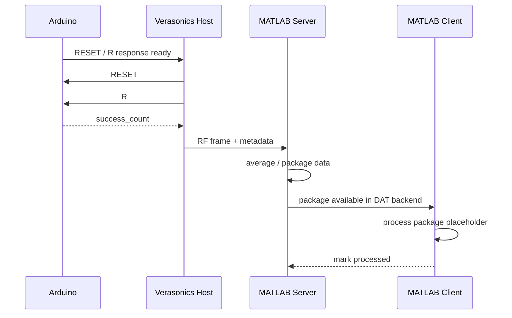

# Minimal Idea

This document explains the smallest possible picture of the system.
The goal is to make the workflow look simple first, even before the full hardware details are filled in.

This minimal picture uses the initial OPOTEK + Verasonics style path as an example,
while the repository itself is intended to stay general for broader real-time use cases.

## One-Look Summary

- Arduino watches trigger timing and returns a counter.
- Verasonics acquires RF frames and asks Arduino for the current count.
- Verasonics sends the frame plus metadata to the MATLAB TCP server.
- The server stores one package in a temporary DAT memory-mapped backend.
- The MATLAB client reads the package, runs the processing placeholder, and exits after the queue stays empty for a short time.

## Sequence Diagram

## Why It Feels Simple

- Only one message is needed from Arduino: `success_count`.
- Only one packet shape is needed between Verasonics and MATLAB.
- Only one shared DAT file is needed for handoff between MATLAB instances.
- The public draft runs without hardware by default, so users can read the flow first and connect devices later.
- The client does not run forever; it stops after the current queue is drained.

## What You Need To Fill In

1. Your licensed Verasonics sequence setup.
2. Your real TCP receive loop on the server.
3. Your beamforming and ablation-processing code on the client.
4. Your COM port and trigger wiring when hardware is connected.

## Default Public Behavior

- Arduino is disabled unless you enable it in the config.
- The Verasonics host can run in offline demo mode.
- The server and client can be tested with the included mock dataset.
